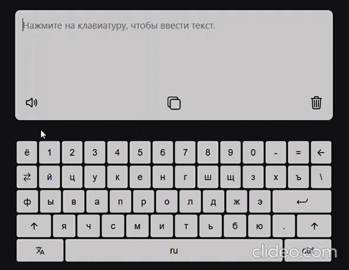

# Virtual keyboard :keyboard: 

<h3 align="center">
  <a align="center" href="https://usweeboy.github.io/virtual-keyboard/">Live Demo</a>
</h3> 

Виртуальная клавиатура, написанная на нативном JavaScript.

Что можно увидеть в проекте:
- Английская и русская раскладка клавиатуры, возможность переключаться между ними;
- Слежение за нажатием кнопок, проицирование их на клавиатуре;
- Нажатие на кнопки и добавление их значений в текстовое поле.
- Возможность прослушать, копировать и очищать текст в текстовом поле.
